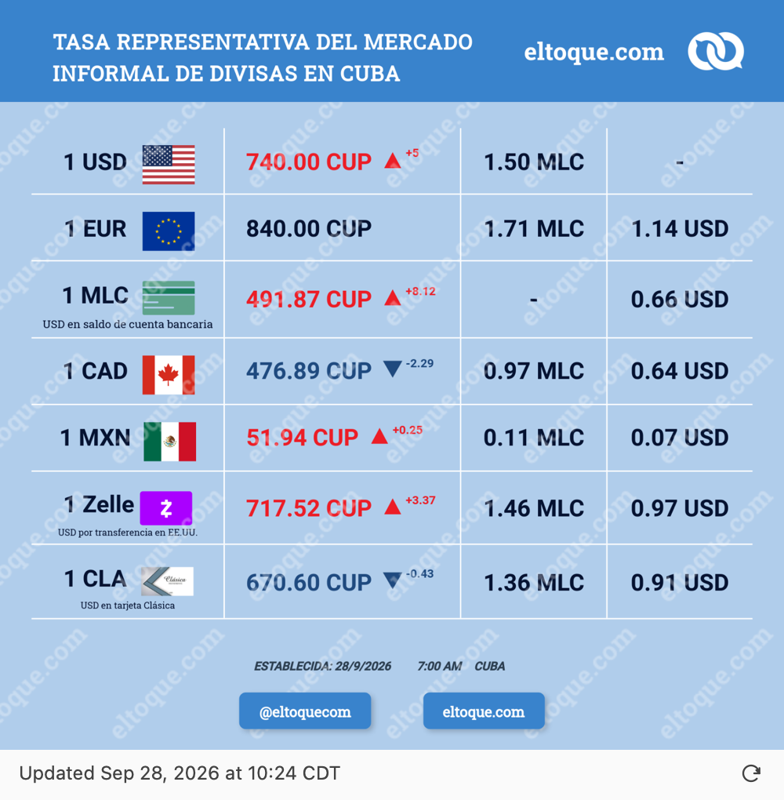
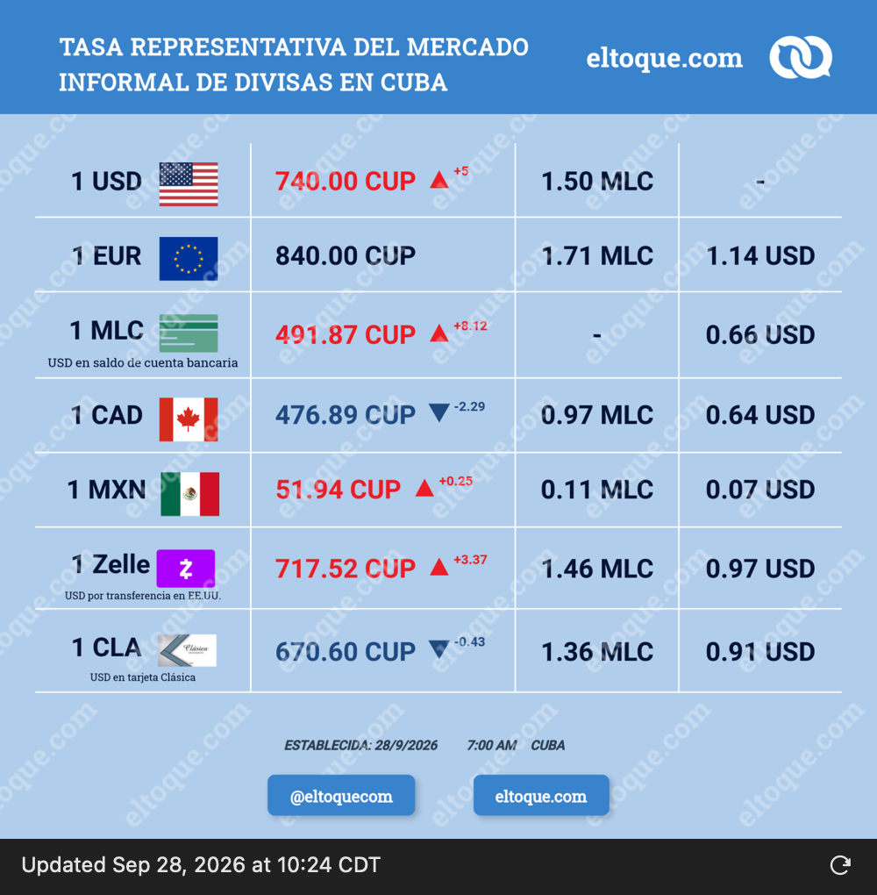

# Currency Exchange for SwiftBar

ElTOQUE's daily Cuban exchange-rate chart, one click from your macOS menu bar.
A small, standalone [SwiftBar](https://github.com/swiftbar/SwiftBar) plugin with the
original exchange icon, automatic refresh, and an offline image cache.

Version 3 replaces the former Electron desktop app. There is no Node.js runtime,
build step, API token, or background server to install.

## Screenshots

| Light appearance | Dark appearance |
| --- | --- |
|  |  |

Actual popup content rendered in macOS WebKit, captured September 28, 2026.
The chart retains its original colors; the compact footer follows macOS appearance.
The rates shown in these screenshots are a snapshot, not live data.

## Features

- **One-click popup:** open the full daily chart from the original exchange icon.
- **Compact footer:** an **Updated** timestamp and a right-aligned, icon-only refresh button.
- **Hourly updates:** downloads the source image at startup and every hour.
- **Manual refresh:** use the footer icon or the menu's **Refresh now** action.
- **Offline cache:** keeps the last valid image when a download fails.
- **Light and dark appearance:** follows macOS without altering the source chart.
- **Simple installation:** one script, using tools already included with macOS.

## Install or update

Install and launch [SwiftBar](https://github.com/swiftbar/SwiftBar/releases), then
choose a plugin folder when prompted. Run this command to install Currency
Exchange or update an existing installation:

```sh
curl -fsSL https://github.com/Carlos-err406/currency-exchange-widget/releases/latest/download/install.sh | bash
```

> The first SwiftBar release is **v3.0.0**. The command above becomes available
> when that release is published. Until then, install from a local checkout below.

The installer finds your configured SwiftBar plugin folder, downloads the plugin
from the installer's exact release, verifies its SHA-256 checksum and version,
and replaces only `currency-exchange.1h.sh`. Other plugins and SwiftBar preferences
are preserved. A failed download or validation leaves your current plugin in place.

To specify the plugin folder yourself:

```sh
curl -fsSL https://github.com/Carlos-err406/currency-exchange-widget/releases/latest/download/install.sh | bash -s -- "$HOME/SwiftBar Plugins"
```

### Local or offline installation

From a clone of this repository, or an extracted release archive:

```sh
./install.sh
# Or choose the destination explicitly:
./install.sh "$HOME/SwiftBar Plugins"
```

The release archive includes the plugin and checksums, so installation from the
archive works offline. An internet connection is needed to fetch new rate images.
You can also copy the executable `currency-exchange.1h.sh` into your plugin folder.

Do **not** set this entire repository as SwiftBar's plugin folder: SwiftBar may
try to execute the installer and development scripts too. Launch SwiftBar if it
is not running; it discovers installed plugins and updates automatically.

## Using the plugin

| Action | Result |
| --- | --- |
| Click the exchange icon | Open the chart popup. |
| Click outside the popup | Close it. |
| Click the footer refresh icon | Request a fresh download. |
| Right-click the menu bar icon | Open the menu with refresh and source links. |
| Choose **Open source image** | Open the original chart in your browser. |

After refreshing, close and reopen the popup to see the updated image. The open
popup does not update in place.

**Updated** is the time the image was successfully downloaded. It is not the
publication time of the exchange rates; that date is printed in the chart itself.

### When a refresh fails

The popup keeps showing the last valid image without a warning. Its **Updated**
timestamp stays unchanged, so an old time means the refresh failed. If there is no
saved image yet, the popup shows an unavailable state with retry instructions.

Downloads have a 15-second timeout and a 5 MiB limit. HTTP errors, invalid PNGs,
and oversized responses do not replace the cached image.

## Troubleshooting

- **The installer cannot find a plugin folder:** open SwiftBar and choose one,
  or pass its path to the installer explicitly.
- **The icon is missing:** launch SwiftBar and check that `currency-exchange.1h.sh`
  is in its configured plugin folder and enabled.
- **The chart looks unchanged after refreshing:** reopen the popup, then check
  the publication date on the chart. The provider may still be serving the same image.
- **The Updated time is old:** check your connection and try the refresh button
  again. A failed refresh does not remove the last valid chart.

## Development

Runtime dependencies are macOS's bundled Bash, curl, sips, base64, and standard
command-line tools. Python 3 is needed only for development tests.

```sh
make check
shellcheck currency-exchange.1h.sh install.sh scripts/package-release.sh
```

The tests exercise image validation, offline states, cache retention, installation
and updates, the piped installer, checksum and version failures, and release
packaging. Network responses are stubbed; tests do not change your SwiftBar setup.
The check workflow runs on macOS for branch pushes and pull requests.

Preview the popup with an isolated cache:

```sh
SWIFTBAR_PLUGIN_CACHE_PATH="$PWD/.preview-cache" ./currency-exchange.1h.sh
open .preview-cache/popup.html
```

| File | Purpose |
| --- | --- |
| `currency-exchange.1h.sh` | Download, validation, cache, popup HTML, and SwiftBar output. |
| `install.sh` | Local installation and the template for the published curl installer. |
| `scripts/package-release.sh` | Version-pinned installer, checksums, and release archive. |
| `tests/` | Plugin and installer integration tests. |
| `docs/screenshots/` | Light and dark captures used in this README. |

SwiftBar supplies `SWIFTBAR_PLUGIN_CACHE_PATH` for its per-plugin cache. Running
the plugin directly uses `~/Library/Caches/currency-exchange-widget` instead.
The popup uses local HTML with an embedded PNG and SwiftBar's
[`webview` parameters](https://github.com/swiftbar/SwiftBar#plugin-api).
It runs no JavaScript or local server.

## Releases

The version lives in the plugin's `xbar.version` metadata. Build matching release
artifacts locally with:

```sh
./scripts/package-release.sh v3.0.1
```

Artifacts are written to `dist/v3.0.1/`. Pushing a matching `v*` tag triggers the
release workflow, which:

1. Runs the macOS checks and verifies the tag matches the plugin version.
2. Packages and smoke-tests the installer.
3. Creates a draft release with the plugin, pinned installer, README,
   `SHA256SUMS`, and a `.tar.gz` archive containing the documentation and screenshots.
4. Downloads and verifies the uploaded assets before publishing the release.

Stable releases become the latest release used by the curl command. Prereleases
leave that URL unchanged. Existing releases are never overwritten on a retry.
If verification fails, inspect and remove the failed draft before retrying;
changes to a published release require a new version.

## Uninstall and migration

Remove `currency-exchange.1h.sh` from your SwiftBar plugin folder to uninstall.
This does not affect SwiftBar or other plugins.

The SwiftBar plugin replaces the Electron app. If the old app is still installed,
quit or uninstall it separately; the installer does not remove it automatically.
Earlier Electron versions remain in Git history and GitHub Releases.

## Data source

The chart comes from [ElTOQUE / CambioCuba](https://wa.cambiocuba.money/trmi.png).
This project displays the original image and does not calculate or reinterpret
exchange rates. Chart and data credit belongs to their provider.
